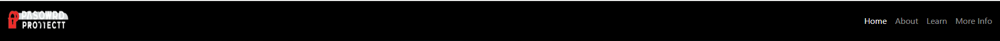
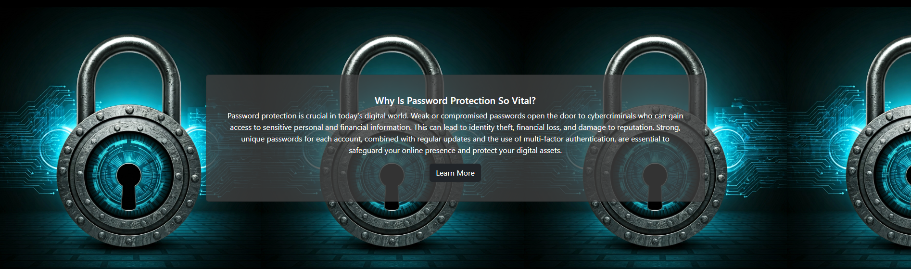
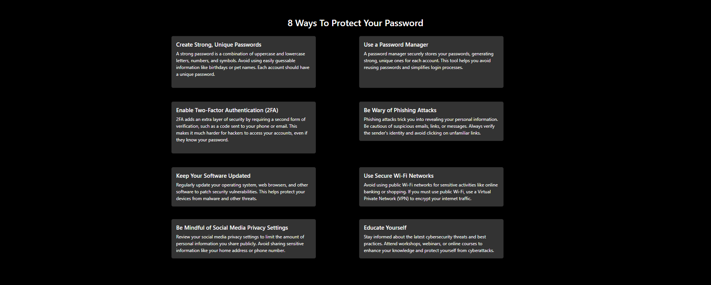
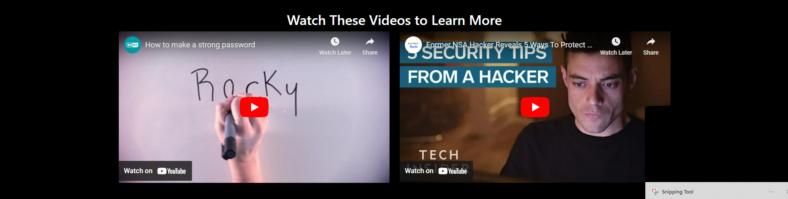
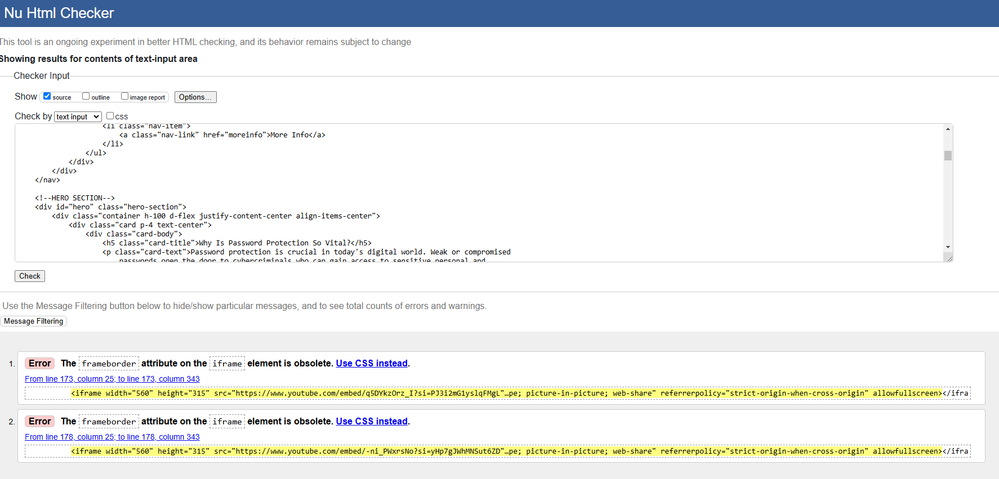
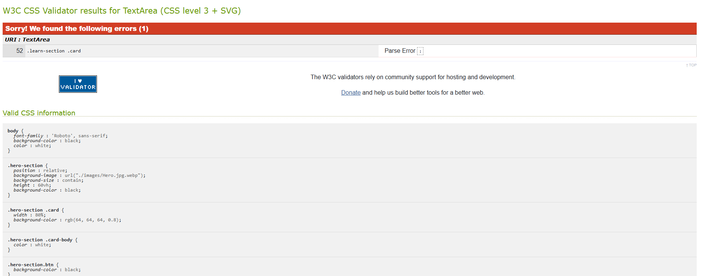

# PasswordProtected

## Overview

[View live project here](https://rayyanfr1.github.io/PasswordProtected/)

### User Stories

- As a user, I want to be able to view information on the topic that is clear and concise.

- As a user, I want to be able to navigate the site quickly via a menu / menu bar.

- As a user, I would like to be able to find relevant information easily.

- As a user, I want access to tips and guidelines on how to protect sensitive information and signs to look out for.

- As a user, I would like access to further resources on the topic.

- As a user, I want access to social media accounts to follow for additional info.

- As a user, I want the option to sign up for a newsletter regarding updates and news on the topic.

## Design

### Wireframes

Wireframe - desktop 1

Wireframe - desktop 2

Wireframe - desktop 3

### Colour Scheme
- For the colour scheme I used a limited amount of colours with the majority of the website being a black background and white text. A dark was used alongside this to highlight certain elements and features such as buttons, menu items and content sections. 

- The page was designed to be simple and to focus on the content hence the colours chosen.

  

.png)

## Features
- Navbar

  

- Hero section

- Learn information cards

- Embedded videos

Social media links in footer

## Testing and validation

### Testing Results
A range of devices were used when testing the functionality of the website.
The devices included were :

- iPhone 11 pro max (real-world)
- Google Pixel 7 (real-world)
- iPad pro 2021 (real-world)
- Alienware AW2521HF 24.5" monitor (real-world)
- iPhone 12 (dev-tools)
- Asus Zenbook Fold (dev-tools)

### Validation
HTML validation

 

CSS validation

## Deployment
Here are the steps taken to deploy the website :

- Go to github.com/rayyanfr1.
- Select the passwordprotected-Project repositry.
- Open the settings tab located near the top of the screen.
- Use the menu bar on the left to navigate to the pages section.
- In the pages section check the source is set to deploy from a branch.
- Below this in the branch section set the branch to Main and the folder to /root.
- Once you have completed this click save.
- After a minute or so the live project link should appear above.

## Bugs

## Credits

### Content
- https://github.com/amylour (README inspo)

- Google AI (content)

- Microsoft Copilot 

-DalE Image Generator 

-Imagen 3 Image Generator 

### Media

- https://fontawesome.com/ (Icons)

- https://convertio.co/ (File convertion)

- https://gemini.com/ (Image Generator)

### Testing
- https://validator.w3.org/

- https://jigsaw.w3.org/css-validator/

## Future Improvements

- Make the website more responsive to serve and cover many variants of device, due to shortage of time, it was'nt possible.

- Implement the unfinished newsletter sign up so users have the oportunity to gain further knowledge on the topic